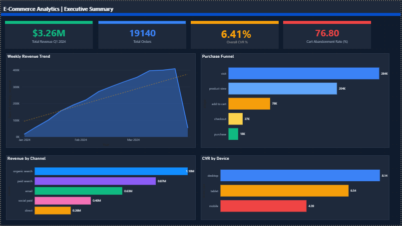
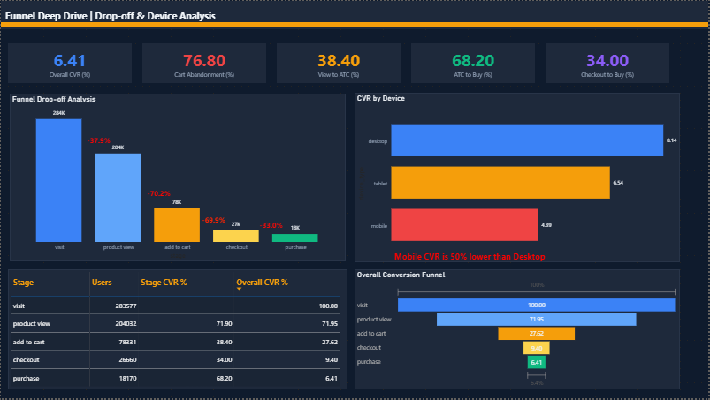
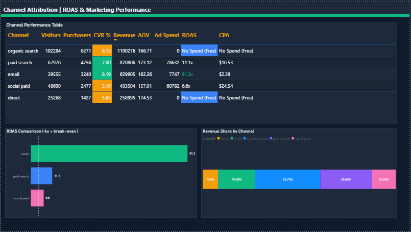
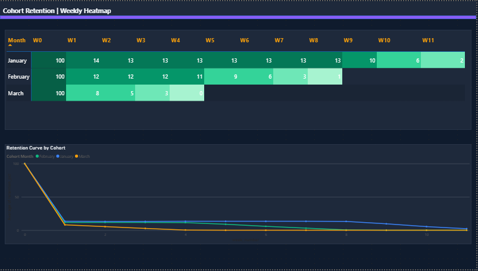
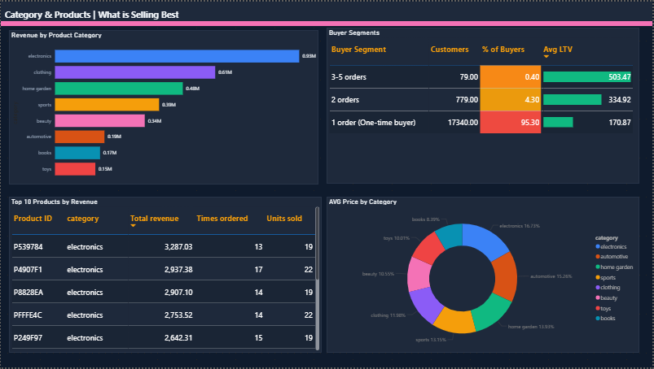

# 🛒 E-Commerce Funnel Analytics
> *From raw data to revenue insights — a full-stack analytics project built entirely from scratch*



I built this project to answer one question every e-commerce business asks:
**"Where exactly are we losing customers — and what do we do about it?"**

Starting with zero data, I generated a realistic 284,000-user dataset, modelled it in MySQL, wrote 20+ SQL queries, and turned the results into a 5-page Power BI dashboard that tells a complete business story. Everything from database design to the final chart is documented here.

---

## 🔍 The Business Problem

An e-commerce company has thousands of daily visitors, a working checkout flow, and revenue coming in. But nobody knows **why 93.6% of visitors leave without buying**, which marketing channels are actually worth the budget, or whether customers ever come back after their first purchase.

This project answers all three questions with data.

---

## 💡 Key Findings

### 🚨 1. View → Add to Cart Is the #1 Drop-off (70.2% lost)
Only 29.8% of users who view a product actually add it to their cart. This is the single highest-volume loss in the funnel — 125,701 users disappear right here. Root causes: lack of social proof, unclear pricing, slow image loads on mobile. Quick wins: product review badges, "only 3 left" urgency signals, one-click ATC buttons.

### 📧 2. Email Delivers 81.3x ROAS — The Most Underutilised Channel
With only $7,747 spent, email generated $629,905 in revenue. Compare that to social paid at 6.6x and display at literally 0x on $24K of spend. Email is running at a tiny fraction of its potential. Scaling abandoned-cart flows triggered at 1hr, 24hr, and 72hr post-abandonment is the single highest-ROI growth lever in this entire dataset.

### 📱 3. Mobile CVR Is Half of Desktop (4.39% vs 8.14%)
42% of sessions are on mobile but mobile converts at half the desktop rate. Closing just half of this gap — with Apple Pay, Google Pay, and a streamlined checkout — could add hundreds of thousands in quarterly revenue with zero additional ad spend.

### 🚫 4. Display Ads: $24K Spent, $0 Revenue
Zero orders. Zero revenue. $24,000 gone. Pause all display campaigns immediately and reallocate to email and paid search where the data shows real returns.

### 🔄 5. January Cohort Holds 13% Weekly Retention for 8 Straight Weeks
The most mature cohort maintains consistent 13% weekly return rate from W1 through W8 — a loyal core segment worth targeting with loyalty programs. February starts decaying at W5, which a re-engagement email at W4 could prevent.

---

## 📊 Dashboard — 5 Pages

### Page 1 — Executive Summary

The one-page overview. Revenue, orders, CVR, cart abandonment, weekly trend, funnel snapshot, channel revenue, device performance — all in one view.
**$3.26M revenue · 19,140 orders · 6.41% CVR · 76.8% cart abandonment**

### Page 2 — Funnel Deep-Dive

Drop-off labels between every funnel stage make the problem areas impossible to miss. CVR by device shows which users are most at risk.
**Biggest leak: -70.2% from Product View → Add to Cart**

### Page 3 — Channel Attribution

Every acquisition channel ranked by ROAS, CPA, and CVR. Conditional formatting makes winners and losers immediately obvious. The 4x break-even line on the ROAS chart turns a number into a decision.
**Email 81.3x · Paid Search 11.1x · Display 0x**

### Page 4 — Cohort Retention

A green-gradient heatmap showing week-by-week return rates for all three Q1 cohorts. The decay pattern tells you exactly when customers start leaving.
**January cohort: stable 13% retention through Week 8**

### Page 5 — Category and Products

Which categories drive revenue, which products are bestsellers, and who your customers really are.
**95.3% of customers bought only once — the biggest retention opportunity**

---

## 🗃️ Dataset

Fully synthetic — no real user data. Generated to reflect realistic e-commerce behaviour.

| Table | Rows | Description |
|-------|------|-------------|
| users | 284,000 | Acquisition channel, device, signup date |
| events | 1.2M+ | Every visit, view, cart add, checkout, purchase |
| sessions | 380,000 | Session-level data |
| orders | 19,140 | Completed orders with revenue |
| order_items | 47,000+ | Line items — category, price, quantity |
| ad_spend | 180 rows | Daily spend by channel, Q1 2024 |

---

## 🛠️ Tech Stack

| Tool | Purpose |
|------|---------|
| **MySQL 8.0** | Database design, storage, all SQL analysis |
| **MySQL Workbench** | Query writing, execution, CSV export |
| **Power BI Desktop** | 5-page dashboard, conditional formatting |
| **Power Query** | Data types, reshaping, cohort unpivoting |

---

## 🧠 SQL Highlights

```sql
-- Funnel drop-off % using window functions
ROUND(COUNT(DISTINCT user_id) * 100.0 /
    LAG(COUNT(DISTINCT user_id)) OVER (
        ORDER BY CASE event_type
            WHEN 'visit'          THEN 1
            WHEN 'product_view'   THEN 2
            WHEN 'add_to_cart'    THEN 3
            WHEN 'checkout_start' THEN 4
            WHEN 'purchase'       THEN 5
        END), 1) AS stage_cvr_pct
```

```sql
-- Cohort week buckets using DATEDIFF
FLOOR(DATEDIFF(e.event_ts, f.first_date) / 7) AS week_num
```

```sql
-- Safe ROAS handling zero ad spend channels
CASE
    WHEN COALESCE(SUM(a.spend_usd), 0) = 0
    THEN 'No Spend (Free)'
    ELSE CONCAT(ROUND(SUM(o.total_amount) /
         SUM(a.spend_usd), 1), 'x')
END AS roas
```

Full query file → [`sql/all_queries.sql`](sql/all_queries.sql)

---

## 📁 Project Structure

```
ecommerce-analytics/
│
├── README.md
├── sql/
│   ├── schema.sql            ← Table creation
│   ├── load_data.sql         ← Data loading
│   └── all_queries.sql       ← All 20+ analysis queries
│
├── data/                     ← Source CSV files
│   ├── users.csv
│   ├── events.csv
│   ├── orders.csv
│   ├── order_items.csv
│   ├── sessions.csv
│   └── ad_spend.csv
│
├── results/                  ← Query outputs for Power BI
│   └── ... (14 CSV files)
│
├── dashboard/
│   └── ecommerce_analytics.pbix
│
└── screenshots/
    └── ... (5 page screenshots)
```

---

## ▶️ How to Run

**You need:** MySQL 8.0+ · MySQL Workbench · Power BI Desktop (both free)

```sql
-- 1. Create database
source sql/schema.sql
```

```bash
# 2. Load data (run from terminal, not Workbench)
mysql --local-infile=1 -u root -p ecom_analytics < sql/load_data.sql
```

```sql
-- 3. Verify
SELECT 'users', COUNT(*) FROM users
UNION ALL SELECT 'events', COUNT(*) FROM events
UNION ALL SELECT 'orders', COUNT(*) FROM orders;
-- Expected: 284000 · 1.2M+ · 19140
```

```
4. Run all_queries.sql → export each result as CSV → save to results/
5. Open ecommerce_analytics.pbix in Power BI
6. Transform Data → update file paths to your results/ folder
7. Close & Apply → done
```

---

## 📈 Top 3 Recommendations

**1. Fix mobile checkout** — 42% of traffic, half the conversion rate. Add Apple/Google Pay. Highest volume opportunity.

**2. Scale email now** — 81.3x ROAS on $7K spend. The math speaks for itself. Build abandoned cart sequences. Double the budget.

**3. Cut display, move budget to paid search** — 11.1x vs 0x. No new creative needed. Immediate efficiency gain.

---

*Built as a portfolio project to demonstrate end-to-end data analytics — from problem framing through SQL analysis to business recommendation.*

*Questions or feedback? Open an issue or connect on LinkedIn.*

*If this helped you, a ⭐ would mean a lot.*
