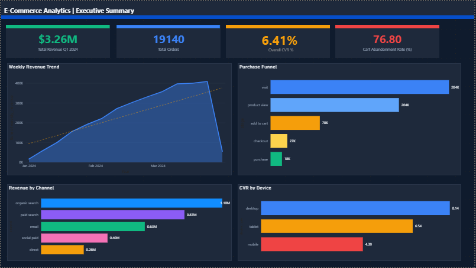
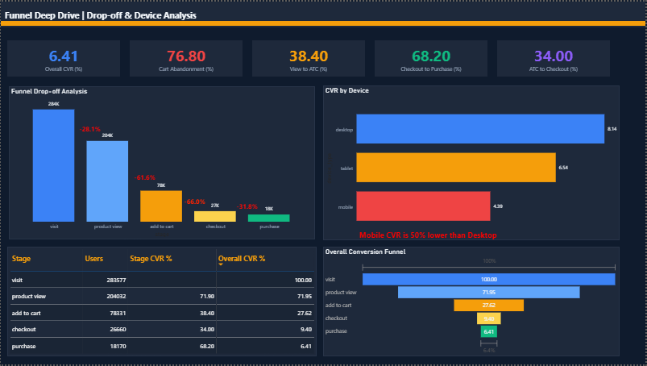
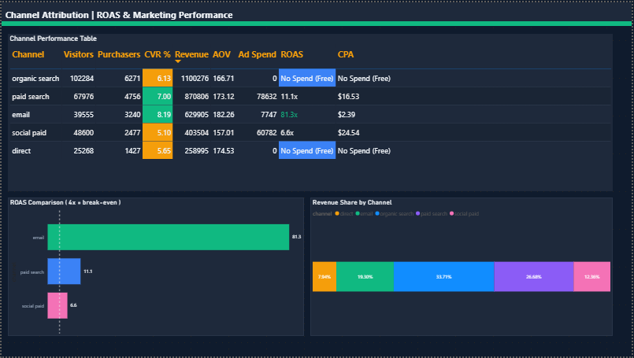
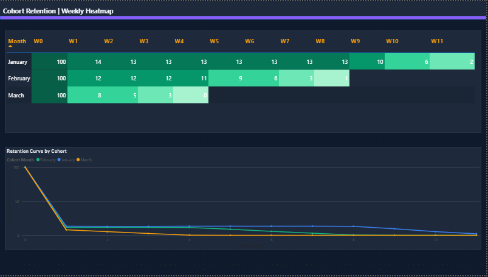
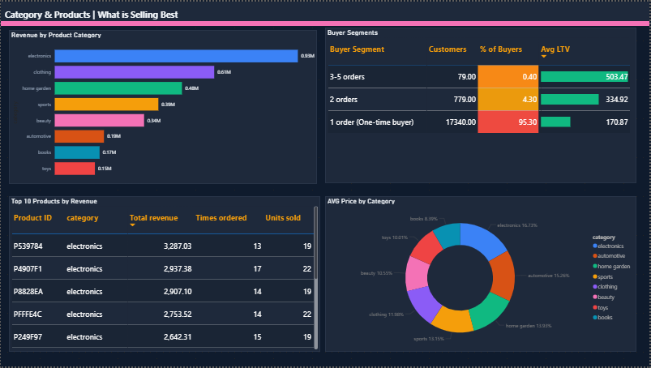

# 🛒 E-Commerce Funnel Analytics
> *From raw data to revenue insights — a full-stack analytics project built entirely from scratch*



I built this project to answer one question every e-commerce business asks:
**"Where exactly are we losing customers — and what do we do about it?"**

Starting with zero data, I generated a realistic 284,000-user dataset, modelled it in MySQL, wrote 20+ SQL queries, and built a 5-page Power BI dashboard around the findings. Everything from database design to the final recommendation is documented here.

---

## 🔍 The Business Problem

An e-commerce company has thousands of daily visitors, a working checkout flow, and revenue coming in — but no visibility into where customers drop off, which marketing channels are actually worth the spend, or whether anyone comes back after their first purchase.

This project answers all three.

---

## 💡 Key Findings

### 🚨 1. Product View → Add to Cart: Biggest Drop in Volume (125,701 users lost)

Only 38.4% of users who viewed a product added it to their cart — that's 125,701 people gone at a single stage, the largest absolute drop in the funnel. But the more actionable problem is what happens after: **76.8% of users who added to cart never purchased**. These are the highest-intent users in the funnel — they already chose a product. A well-timed abandoned-cart email, a cleaner checkout, or showing the full cost upfront can recover a meaningful chunk of them.

### 📧 2. Email Is the Highest-ROI Channel and It's Being Underused

$7,747 spent on email generated $629,905 in revenue — an 81.3x return. Paid search came in at 11.1x. Social paid at 6.6x. Display had $24K in spend with no attributed revenue. The gap between email and everything else is large enough that scaling abandoned-cart flows is probably the single highest-ROI action available.

### 📱 3. Mobile Converts at Half the Rate of Desktop

42% of sessions happen on mobile, but mobile CVR is 4.39% versus 8.14% on desktop. That's not a traffic problem — it's a checkout friction problem. Adding Apple Pay and Google Pay would be the first thing I'd test.

### 🔄 4. The January Cohort Stays Engaged — February Doesn't

The January cohort held 13–14% weekly retention from Week 1 through Week 8 — a stable loyal base. The February cohort dropped from 11% at Week 4 to 9% at Week 5 and kept falling. A re-engagement email sent at Week 4, before the decay starts, could prevent that churn.

### 👤 5. 95.3% of Customers Bought Only Once

17,340 out of 18,198 customers placed exactly one order. One-time buyers average $171 in lifetime value. Customers with 3–5 orders average $503. The math on converting even a small fraction of one-time buyers to repeat buyers is compelling — and the lever is a post-purchase email sequence, not more ad spend.

---

## 📊 Dashboard — 5 Pages

### Page 1 — Executive Summary

The one-page overview for anyone who has two minutes. Revenue, orders, CVR, cart abandonment, weekly revenue trend, purchase funnel snapshot, channel revenue, and CVR by device — all in one view.

**$3.26M revenue · 19,140 orders · 6.41% CVR · 76.8% cart abandonment**

### Page 2 — Funnel Deep-Dive

Stage-by-stage drop-off rates with both absolute user counts and percentage labels. CVR broken down by device type. A summary table showing stage CVR and overall CVR at every step.

**Largest absolute drop: 125,701 users at Product View → Add to Cart · Cart abandonment: 76.8%**

### Page 3 — Channel Attribution

All acquisition channels ranked by ROAS, CPA, and CVR. Conditional formatting makes the winners and losers obvious without reading every number. The 4x break-even line on the ROAS chart turns a number into a decision.

**Email 81.3x · Paid Search 11.1x · Social 6.6x · Display: $24K spend, 0x attributed return**

### Page 4 — Cohort Retention

A green-gradient heatmap tracking weekly return rates for all three Q1 cohorts, plus a retention curve chart showing all three side by side.

**January: stable 13–14% through Week 8 · February: decays at Week 5**

### Page 5 — Category and Products

Revenue by category, top 10 products by revenue, buyer segments by order frequency and LTV, and average price by category.

**Electronics leads revenue · 95.3% of customers bought only once**

---

## 🗃️ Dataset

Fully synthetic — no real user data. Generated using a Python script with funnel probabilities and channel parameters informed by published e-commerce benchmarks.

| Table | Rows | Description |
|-------|------|-------------|
| users | 284,000 | Acquisition channel, device, signup date |
| events | 1.2M+ | Every visit, product view, cart add, checkout, purchase |
| sessions | 380,000 | Session-level data |
| orders | 19,140 | Completed orders with revenue |
| order_items | 47,000+ | Line items — category, price, quantity |
| ad_spend | ~360 rows | Daily spend by channel across Q1 2024 |

---

## 🛠️ Tech Stack

| Tool | Purpose |
|------|---------|
| **Python** | Synthetic dataset generation |
| **MySQL 8.0** | Database design, storage, all SQL analysis |
| **MySQL Workbench** | Query writing, execution, CSV export |
| **Power BI Desktop** | 5-page dashboard, conditional formatting |
| **Power Query** | Data types, reshaping, cohort unpivoting |

---

## 🧠 SQL Highlights

```sql
-- Funnel stage CVR using LAG window function
-- A CTE first counts distinct users per stage,
-- then LAG fetches the previous stage's count for the % calculation
ROUND(users * 100.0 /
    LAG(users) OVER (ORDER BY stage_order), 1) AS stage_cvr_pct
```

```sql
-- Cohort week number from each user's first visit date
FLOOR(DATEDIFF(e.event_ts, f.first_date) / 7) AS week_num
```

```sql
-- ROAS with safe handling for zero-spend channels
CASE
    WHEN COALESCE(SUM(a.spend_usd), 0) = 0
    THEN 'No Spend (Free)'
    ELSE CONCAT(ROUND(SUM(o.total_amount) /
         SUM(a.spend_usd), 1), 'x')
END AS roas
```

Full query file → [`sql/all_queries.sql`](sql/all_queries.sql)

---

## 📁 Project Structure

```
ecommerce-analytics/
│
├── README.md
├── sql/
│   ├── schema.sql            ← Table creation
│   └── all_queries.sql       ← All 20+ analysis queries
│
├── data/                     ← Source CSV files
│   ├── users.csv
│   ├── events.csv
│   ├── orders.csv
│   ├── order_items.csv
│   ├── sessions.csv
│   └── ad_spend.csv
│
├── results/                  ← Query outputs for Power BI
│   └── ... (14 CSV files)
│
├── dashboard/
│   └── ecommerce_analytics.pbix
│
└── screenshots/
    └── ... (5 page screenshots)
```

---

## 📈 Business Recommendations

**1. Target cart abandoners first** — 76.8% of users who added to cart didn't buy. They already chose a product. An abandoned-cart email sequence (1hr, 24hr, 72hr) is the cheapest way to recover them.

**2. Fix mobile checkout** — 42% of traffic, half the conversion rate. Apple Pay and Google Pay reduce checkout to one tap. No additional ad spend needed.

**3. Scale email, cut display** — Email is returning 81.3x on $7.7K spend. Display returned nothing on $24K. Move that budget to email or paid search where the data shows real returns.

**4. Send a re-engagement email at Week 4** — February cohort data shows decay beginning at Week 5. Catching users one week before they drift is easier than winning them back after.

**5. Build a post-purchase sequence** — 95.3% of customers bought once. VIP customers (3–5 orders) are worth $503 in lifetime value versus $171 for one-time buyers. A single well-timed follow-up email after the first purchase is the highest-LTV lever in this dataset.

---

## ⚠️ A Note on Attribution

All channel analysis uses last-touch attribution — the final channel before purchase gets 100% of the revenue credit. This likely understates display and social (which contribute to awareness early in the journey) and overstates email and direct. The directional findings are strong, but anyone acting on budget reallocation should validate with a multi-touch model on real data.

---

*Built as a portfolio project to demonstrate end-to-end analytics — from problem framing and data generation through SQL analysis to business recommendation.*

*Questions or feedback? Open an issue or connect on LinkedIn.*

*If this helped you, a ⭐ would mean a lot.* you, a ⭐ would mean a lot.*
